### Hi, I am Yicheng, a Blockchain Engineer
-  Interested in implement real-world stuff into web3 world.
-  Interested in low-level programming (C++, Rust). 
-  Currently enrolled in WQU (WorldQuant University)'s MSc in Financial Engineering.

  
<!---
yluoc/yluoc is a ✨ special ✨ repository because its `README.md` (this file) appears on your GitHub profile.
You can click the Preview link to take a look at your changes.
--->
